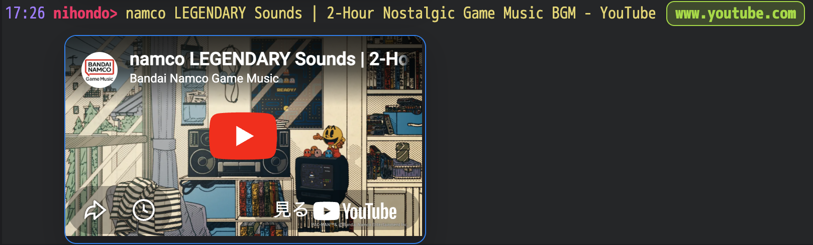
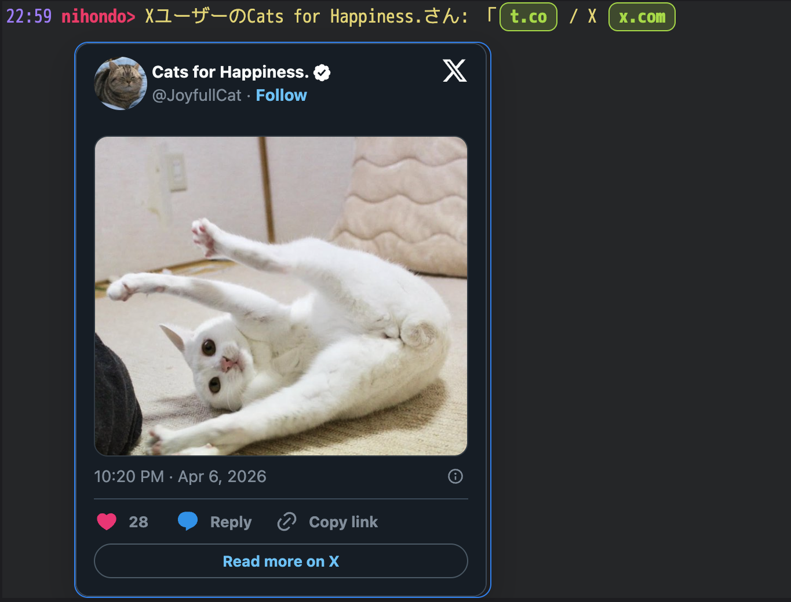
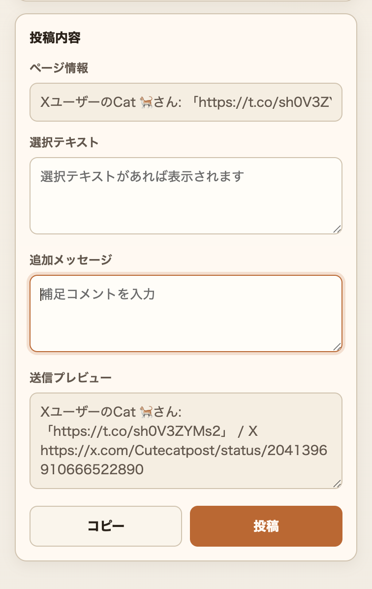
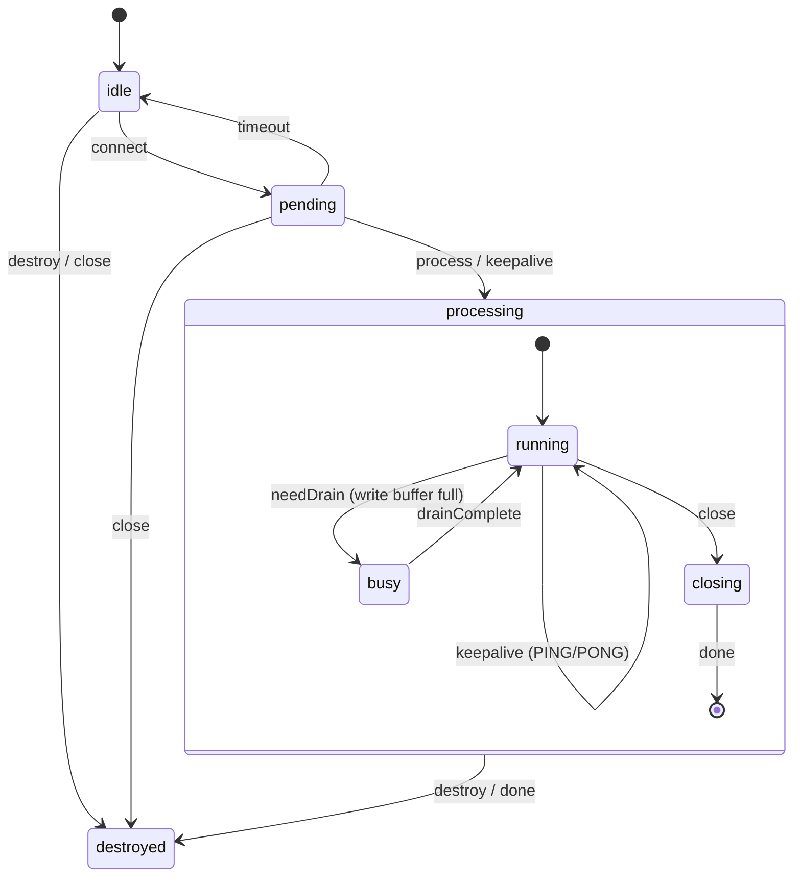

# apricot IRC Proxy


An IRC proxy that keeps a persistent connection to an IRC server and lets you join chat through **three paths: browser, IRC client, and REST API**.
It runs on Cloudflare Workers + Durable Objects.

I had been relying on the Perl IRC proxy "plum" for a long time, then asked Claude Code to make it run on Cloudflare Workers, and this is what came out.

---
## What It Can Do
- Keep a persistent IRC connection alive, with automatic reconnect after disconnects
- Browser-based chat interface with theme customization and keyword highlighting
- Connect from WebSocket-capable IRC clients
- Control via REST API, including joining channels, posting messages, and changing nick
- Automatically fetch page titles when URLs are posted, with Twitter/X and YouTube oEmbed support
- Web UI URL image, card, and embed previews, shown either always or on hover / long press



---

## Quick Start (Initial Setup)

[getting-started.md](getting-started.md) summarizes the basic setup and usage flow.

### 1. Install Dependencies

```bash
cd workers
npm install
```

### 2. Configure the IRC Server

Describe the target server in the `[vars]` section of `workers/wrangler.toml`:

```toml
[vars]
IRC_HOST = "irc.libera.chat"
IRC_PORT = "6667"
IRC_NICK = "apricotbot"
IRC_USER = "apricotbot"
IRC_REALNAME = "apricot IRC Proxy"
IRC_TLS = "false"
IRC_AUTO_CONNECT_ON_STARTUP = "true"
IRC_AUTO_RECONNECT_ON_DISCONNECT = "true"
IRC_CONNECT_TIMEOUT_MS = "10000"
IRC_REGISTRATION_TIMEOUT_MS = "120000"
IRC_RECONNECT_BASE_DELAY_MS = "5000"
IRC_RECONNECT_MAX_DELAY_MS = "60000"
IRC_RECONNECT_JITTER_RATIO = "0.2"
IRC_IDLE_PING_INTERVAL_MS = "240000"
IRC_PING_TIMEOUT_MS = "90000"
IRC_AUTOJOIN = "#general,#test"
IRC_ENCODING = "iso-2022-jp"   # For Japanese IRC servers
TIMEZONE_OFFSET = "9"          # JST (UTC+9)
ENABLE_REMOTE_URL_PREVIEW = "false"
```

> **Note**: `IRC_NICK` and `IRC_AUTOJOIN` are shared defaults for all proxy IDs. Because nick is automatically derived from the proxy ID on first access, you do not need to set `IRC_NICK` if each person uses one proxy ID. If you want different nick or autojoin values per proxy ID, use `PUT /api/config`.

Put secrets such as API keys in `.dev.vars` for local development (`.gitignore` already covers it):

```ini
API_KEY=your-local-api-key
IRC_PASSWORD=optional-server-password
CLIENT_PASSWORD=required-client-password
CLOUDFLARE_ACCOUNT_ID=your-cloudflare-account-id
CLOUDFLARE_BROWSER_RENDERING_API_TOKEN=optional-browser-rendering-token
```

`CLIENT_PASSWORD` is required for both the Web UI and WebSocket connections.
If it is unset, `/web/*` and `/ws` return `503`.
If both `CLOUDFLARE_ACCOUNT_ID` and `CLOUDFLARE_BROWSER_RENDERING_API_TOKEN` are set, `POST /api/post` prefers a rendered-page title fetched through the Cloudflare Browser Rendering API when `url` is specified. If those values are missing, or the fetch fails, it falls back to extracting the static HTML `<title>`.

### 3. Start Locally

```bash
npm run dev
```

It starts at `http://localhost:8787`, and Durable Objects are emulated locally as well.

> **Note**: TCP connections through `cloudflare:sockets` also work in local development, but the target IRC server must allow access from `localhost`.

### 4. Connect to the IRC Server

```bash
curl -X POST http://localhost:8787/proxy/myproxy/api/connect \
  -H "Authorization: Bearer your-api-key"
```

The connection starts asynchronously. To check the status:

```bash
curl http://localhost:8787/proxy/myproxy/api/status \
  -H "Authorization: Bearer your-api-key"
```

Example response:

```json
{
  "connected": true,
  "nick": "myproxy",
  "channels": ["#general", "#test"],
  "clients": 1,
  "serverName": "irc.libera.chat"
}
```

## Using It with Multiple Users

One Workers deployment can be shared by multiple people.

apricot manages IRC sessions by an identifier called a **proxy ID**. The `/proxy/<ID>/` part of the URL is the proxy ID.

```
Alice → https://.../proxy/alice/web/   ← "alice" is the proxy ID
Bob   → https://.../proxy/bob/web/     ← "bob" is the proxy ID
```

Each proxy ID has its own isolated environment:

- IRC connection, with nick automatically derived from the proxy ID on first access
- Channel state and message logs
- Web UI display settings

On first access, the proxy ID is automatically used as the IRC nickname. For example, if the proxy ID is `alice`, the nick becomes `alice`.

**Caution**: `CLIENT_PASSWORD` can only be configured once for the whole deployment. You cannot assign different passwords per proxy ID, so all users share the same password. IRC server connection settings such as `IRC_HOST` are also shared across all proxy IDs.

## Usage Guides by Scenario

### Use It from a Browser (Web UI)

Open the following URL in your browser when running locally:

```
http://localhost:8787/proxy/myproxy/web/
```

> **Note**: `CLIENT_PASSWORD` is required to use the Web UI. If it is unset, the endpoint returns `503`.

Select one of the joined channels from the **channel list page** to move to the channel view.

Inside the channel view you can:
- Send and receive messages
- Get automatic linkification for URLs
- See updates reflected automatically
- Recover with automatic resync if the connection becomes unstable

On the channel list page you can:
- Join or leave channels
- Change your nickname
- Save default connection settings such as `nick` and `autojoin`
- Open the settings screen, if password-based access is enabled


#### Web UI Display Customization

From the settings page (`/proxy/:id/web/settings`), you can change:

- **Font and text size**: font family and size for the channel view
- **Color theme**: theme settings through 13 color pickers, with light and dark presets
- **Display order**: toggle between ascending (`asc`) and descending (`desc`)
- **URL previews**: choose whether image / card / embed previews are always visible, or shown only on hover / long press when disabled
- **Keywords to highlight**: visually emphasize matching words
- **Muted keywords**: dim messages that contain specific words
- **Additional CSS**: restricted CSS applied only to the channel view


These settings are saved per proxy ID and apply only to the channel view. Additional CSS is not inlined directly into a `<style>` tag. Instead, it is served as a separate stylesheet from `/proxy/:id/web/theme.css`.
Only styles under predefined selectors such as `.channel-shell` are allowed, and only visual properties such as colors, spacing, fonts, and borders are accepted. Selectors containing `@import`, `url()`, `content:`, `html`, `body`, `iframe`, or `*` are rejected.

> **Note**: The settings page is available only when `CLIENT_PASSWORD` is configured.
> **Note**: The channel list page (`/proxy/:id/web/`) can also save `nick` and `autojoin` as default connection settings equivalent to `PUT /api/config`. These saved values are not applied to the current connection immediately.

---

### Use It from an IRC Client

You can connect through WebSocket from standard IRC clients such as WeeChat or irssi.

> **Note**: `CLIENT_PASSWORD` is also required for WebSocket connections. If it is unset, the endpoint returns `503`.

Target endpoint:

```
ws://localhost:8787/proxy/myproxy/ws
```

Client-side example configuration for WeeChat:

```
/server add apricot localhost/8787 -ssl=false
/set irc.server.apricot.addresses "localhost/8787"
/set irc.server.apricot.password "clientpassword"
/connect apricot
```

After connecting, the proxy automatically syncs channels it has already joined by replaying `JOIN`, `TOPIC`, and `NAMES`.

---

### Use It from External Scripts or APIs

This is the REST API for operating IRC channels programmatically.
Authentication requires the `Authorization: Bearer <API_KEY>` header.

#### Join a Channel

```bash
curl -X POST http://localhost:8787/proxy/myproxy/api/join \
  -H "Content-Type: application/json" \
  -H "Authorization: Bearer your-api-key" \
  -d '{"channel": "#general"}'
```

> **Tip**: If you want channels to be joined automatically on connect, specify them in `IRC_AUTOJOIN` inside `wrangler.toml`.

#### Leave a Channel

```bash
curl -X POST http://localhost:8787/proxy/myproxy/api/leave \
  -H "Content-Type: application/json" \
  -H "Authorization: Bearer your-api-key" \
  -d '{"channel": "#general"}'
```

#### Post a Message

```bash
curl -X POST http://localhost:8787/proxy/myproxy/api/post \
  -H "Content-Type: application/json" \
  -H "Authorization: Bearer your-api-key" \
  -d '{"channel": "#general", "message": "Hello from API!"}'
```

#### Post the Current Page from a Chrome Extension

Under `ChromeExtension/`, the repository includes a sample Chrome extension that posts the title and URL of the currently open page as a `message`. It does not use `url` mode. Instead, the extension builds a payload like `Title URL >selected text extra message` on the extension side and sends it to `POST /proxy/:id/api/post`.



1. Open Chrome at `chrome://extensions/`
2. Enable Developer Mode
3. Click "Load unpacked" and select [ChromeExtension](ChromeExtension)
4. In the popup, configure `apricot URL`, `Proxy ID`, `Channel`, and `API Key`
5. Open the page you want to post, open the extension, and click "Post"

#### Post a URL with Retrieved Metadata

If you specify `url` instead of `message`, apricot retrieves the page title and posts it. In the Web UI, image or card previews from the same URL are also stored:

```bash
curl -X POST http://localhost:8787/proxy/myproxy/api/post \
  -H "Content-Type: application/json" \
  -H "Authorization: Bearer your-api-key" \
  -d '{"channel": "#general", "url": "https://example.com/article"}'
```

- **YouTube URLs**: the Web UI stores an iframe embed preview. Standard videos use height `200`, while Shorts use height `631`
- **Twitter/X URLs**: the oEmbed API retrieves the post text and author name, and the Web UI stores either a text card or a rich embed preview
- **General URLs**: if Cloudflare Browser Rendering secrets are configured, apricot prefers the rendered-page `<title>`. Otherwise, or if retrieval fails, it falls back to the HTML `<title>` tag
- **Fallback**: if metadata cannot be retrieved, the raw URL is posted as-is

Automatic URL preview resolution is disabled by default. Set `ENABLE_REMOTE_URL_PREVIEW=true` only when you need it.
This setting is a global switch to prevent excessive external fetch usage, and it applies to all of the following:

- Incoming messages from other people (`ss_privmsg` / `ss_notice`)
- Your own messages posted through the Web composer or `POST /api/post` with `message`

Posts made through `POST /api/post` with `url` always perform metadata retrieval regardless of this flag.

Request body:

| Field | Required | Description |
|-------|:--------:|-------------|
| `channel` | ✅ | Destination channel, for example `#general` |
| `message` | △ | Message text, mutually exclusive with `url` |
| `url` | △ | URL used to retrieve metadata, mutually exclusive with `message` |

#### Change nick

```bash
curl -X POST http://localhost:8787/proxy/myproxy/api/nick \
  -H "Content-Type: application/json" \
  -H "Authorization: Bearer your-api-key" \
  -d '{"nick": "apricot_alt"}'
```

> **Note**: The response waits for the IRC server's reply. If the nick is already in use, an error such as `433 ERR_NICKNAMEINUSE` is returned. If the server does not respond within 5 seconds, the endpoint returns `503`.

#### Configure nick / autojoin per Proxy ID

If you want to override the automatically assigned nick or autojoin per proxy ID, use `PUT /api/config`:

```bash
curl -X PUT http://localhost:8787/proxy/myproxy/api/config \
  -H "Content-Type: application/json" \
  -H "Authorization: Bearer your-api-key" \
  -d '{"nick": "myproxy_alt", "autojoin": ["#general", "#random"]}'
```

The values saved here become the **defaults for the next connection**. If you want to change the current nick immediately, use `POST /api/nick`. Sending `nick: null` or `autojoin: []` clears the saved override and returns that item to the shared default.

The same settings can also be saved from the Web UI channel list page (`/proxy/:id/web/`). In the Web UI, enter `autojoin` one channel per line. Saving an empty field clears the stored value.

#### Disconnect from the IRC Server

```bash
curl -X POST http://localhost:8787/proxy/myproxy/api/disconnect \
  -H "Authorization: Bearer your-api-key"
```

> **Note**: A manual disconnect through the API does not auto-reconnect even if `IRC_AUTO_RECONNECT_ON_DISCONNECT=true`.

#### Fetch Channel Logs

```bash
curl http://localhost:8787/proxy/myproxy/api/logs/%23general \
  -H "Authorization: Bearer your-api-key"
```

Encode the `#` in the channel name as `%23`.

Example response:

```json
{
  "channel": "#general",
  "messages": [
    {"time": 1712160000000, "type": "privmsg", "nick": "alice", "text": "hello!"},
    {"time": 1712160010000, "type": "privmsg", "nick": "apricotbot", "text": "hi there", "embed": {"kind": "card", "sourceUrl": "https://example.com/post", "imageUrl": "https://example.com/card.jpg", "title": "Example", "siteName": "example.com"}}
  ]
}
```

Each object in `messages`:

| Field | Type | Description |
|-------|------|-------------|
| `sequence` | number | Monotonically increasing log sequence within the channel |
| `time` | number | Unix time in milliseconds |
| `type` | string | `privmsg` / `notice` / `join` / `part` / `quit` / `kick` / `nick` / `topic` / `mode` / `self` |
| `nick` | string | Speaker nick |
| `text` | string | Message text, or the target / new value for events such as `nick` and `topic` |
| `embed` | object? | URL preview data for the Web UI, including `kind`, `sourceUrl`, `imageUrl?`, `title?`, `siteName?`, `description?`, and `html?` |

It returns up to `WEB_LOG_MAX_LINES` entries, default `200`, in chronological order. If no buffer exists for the specified channel, the endpoint returns `404`.
This API is meant to retrieve the latest buffer, not to provide a complete long-term archive. In high-traffic channels, older logs may be pushed out before your next poll.

The Web UI settings page lets you choose whether URL previews are always shown below the message body. Even when that option is off, previews are still available from matching URL links through hover / focus on desktop and long-press equivalents on touch devices.

## Deploying to Cloudflare

### 1. Log In to Wrangler

```bash
npx wrangler login
```

### 2. Set Secrets

Configure sensitive values through Wrangler secrets:

```bash
npx wrangler secret put API_KEY
npx wrangler secret put IRC_PASSWORD        # Only if needed
npx wrangler secret put CLIENT_PASSWORD      # Only if needed
```

### 3. Deploy

```bash
npm run deploy
```

### URL After Deployment

```
https://apricot.<your-subdomain>.workers.dev/proxy/myproxy/web/
```

---

## Technical Information

This chapter is technical documentation for operation, extension, and debugging. It is intended to explain internal behavior and design rather than usage steps.

### Environment Variables

| Environment Variable | Required | Default | Description |
|----------------------|:--------:|---------|-------------|
| `IRC_HOST` | ✅ | ─ | IRC server hostname |
| `IRC_PORT` | ─ | `6667` | IRC server port. Ranges and multiple values are supported, for example `6660-6669` or `6660,6667,6697` |
| `IRC_NICK` | ─ | `apricot` | Fallback IRC nickname. In practice, nick is automatically derived from the proxy ID on first access |
| `IRC_USER` | ─ | `apricot` | IRC username |
| `IRC_REALNAME` | ─ | `apricot IRC Proxy` | IRC real name |
| `IRC_TLS` | ─ | `false` | Use TLS for the TCP connection to the IRC server, `true` or `false` |
| `IRC_PASSWORD` | ─ | ─ | IRC server password, storing it as a secret is recommended |
| `CLIENT_PASSWORD` | ─ | ─ | Shared password for WebSocket client connections and Web UI login. If unset, `/web/*` and `/ws` return `503` |
| `IRC_AUTO_CONNECT_ON_STARTUP` | ─ | `false` | Start connecting to IRC when the Durable Object instance starts. The first request returns immediately without waiting for connection completion |
| `IRC_AUTO_RECONNECT_ON_DISCONNECT` | ─ | `false` | Enable automatic reconnect after an IRC disconnect, except for manual API disconnects |
| `IRC_CONNECT_TIMEOUT_MS` | ─ | `10000` | Timeout while waiting for TCP socket establishment, in milliseconds |
| `IRC_REGISTRATION_TIMEOUT_MS` | ─ | `120000` | Registration timeout while waiting for IRC `001` welcome. This is an idle timeout extended while registration-phase messages keep arriving, in milliseconds |
| `IRC_RECONNECT_BASE_DELAY_MS` | ─ | `5000` | Initial wait time for reconnect backoff, in milliseconds |
| `IRC_RECONNECT_MAX_DELAY_MS` | ─ | `60000` | Maximum wait time for reconnect backoff, in milliseconds |
| `IRC_RECONNECT_JITTER_RATIO` | ─ | `0.2` | Jitter ratio added to reconnect delays |
| `IRC_IDLE_PING_INTERVAL_MS` | ─ | `240000` | Idle time before sending an active `PING` when the server stops sending traffic, in milliseconds |
| `IRC_PING_TIMEOUT_MS` | ─ | `90000` | Time to wait for `PONG` or any other inbound message after sending an active `PING`, in milliseconds |
| `IRC_AUTOJOIN` | ─ | ─ | Default auto-join channels as a comma-separated list, for example `#general,#test`. Can be overridden per proxy ID with `PUT /api/config` |
| `IRC_ENCODING` | ─ | `utf-8` | Character encoding used by the IRC server, for example `iso-2022-jp`, `euc-jp`, or `shift_jis` |
| `ENABLE_REMOTE_URL_PREVIEW` | ─ | `false` | Global switch that enables automatic URL preview resolution. Applies to incoming messages and your own posts from the Web composer or API `message`. `POST /api/post` with `url` is always enabled |
| `KEEPALIVE_INTERVAL` | ─ | `60` | DO keepalive interval in seconds |
| `TIMEZONE_OFFSET` | ─ | `9` | Time display offset for the Web UI, in hours. For example, JST is `9` |
| `WEB_LOG_MAX_LINES` | ─ | `200` | Maximum number of retained log lines per channel |
| `API_KEY` | ✅ | ─ | Authentication key for the external API, must be provided as a secret |

> **Note**: In `IRC_AUTO_CONNECT_ON_STARTUP`, "startup" does not mean Cloudflare Workers process startup. It means the moment each proxy ID's Durable Object instance starts in response to its first request or WebSocket connection. The actual connection process begins in the background, so `/api/status` and the initial Web UI response are not blocked.

### About Proxy IDs

The proxy creates an independent Durable Object instance for each **proxy ID**.
Any string can be used as a proxy ID, for example `myproxy` or `main`.
All instances share the same environment-variable configuration, but each IRC connection and channel state is isolated.

Nick resolution order, highest priority first:
1. The per-proxy-ID nick saved through `PUT /api/config`
2. The nick automatically generated from the proxy ID on first access, for example `alice` becomes nick `alice`
3. `IRC_NICK` in `wrangler.toml`

### API Endpoints

| Method | Path | Auth | Description |
|--------|------|:----:|-------------|
| `GET` | `/` or `/health` | ─ | Health check |
| `GET` | `/proxy/:id/ws` | IRC `PASS` | WebSocket connection for IRC clients, requires `CLIENT_PASSWORD` |
| `GET` | `/proxy/:id/web/` | Cookie | Channel list page, requires `CLIENT_PASSWORD` |
| `GET` | `/proxy/:id/web/login` | ─ | Web UI login page, requires `CLIENT_PASSWORD` |
| `POST` | `/proxy/:id/web/login` | ─ | Web UI login, requires `CLIENT_PASSWORD` |
| `POST` | `/proxy/:id/web/logout` | ─ | Web UI logout |
| `POST` | `/proxy/:id/web/config` | Cookie | Save Web UI default connection settings, `nick` / `autojoin` |
| `GET` | `/proxy/:id/web/settings` | Cookie | Web UI display settings page |
| `POST` | `/proxy/:id/web/settings` | Cookie | Save Web UI settings |
| `POST` | `/proxy/:id/web/join` | Cookie | Join a channel from the Web UI |
| `POST` | `/proxy/:id/web/leave` | Cookie | Leave a channel from the Web UI |
| `POST` | `/proxy/:id/web/nick` | Cookie | Change nickname from the Web UI |
| `GET` | `/proxy/:id/web/theme.css` | Cookie | Custom CSS for the channel view |
| `GET` | `/proxy/:id/web/:channel` | Cookie | Channel shell page |
| `GET` | `/proxy/:id/web/:channel/messages` | Cookie | Message list frame |
| `GET` | `/proxy/:id/web/:channel/messages/fragment` | Cookie | HTML fragment for message updates inside the Web UI, usually used with `since` |
| `GET` | `/proxy/:id/web/:channel/updates` | Cookie | WebSocket for message update notifications used by the Web UI |
| `GET` | `/proxy/:id/web/:channel/composer` | Cookie | Input form frame |
| `POST` | `/proxy/:id/web/:channel/composer` | Cookie | Send a message from the Web form |
| `POST` | `/proxy/:id/api/connect` | Bearer | Connect to the IRC server |
| `POST` | `/proxy/:id/api/disconnect` | Bearer | Manually disconnect from the IRC server |
| `POST` | `/proxy/:id/api/join` | Bearer | Join a channel |
| `POST` | `/proxy/:id/api/leave` | Bearer | Leave a channel |
| `POST` | `/proxy/:id/api/post` | Bearer | External post |
| `POST` | `/proxy/:id/api/nick` | Bearer | Change nick immediately by sending IRC `NICK` |
| `PUT` | `/proxy/:id/api/config` | Bearer | Save `nick` / `autojoin` per proxy ID |
| `GET` | `/proxy/:id/api/logs/:channel` | Bearer | Fetch channel logs |
| `GET` | `/proxy/:id/api/status` | Bearer | Check connection status |
| `OPTIONS` | `/proxy/:id/api/*` | ─ | CORS preflight |

> **Note**: `/api/*` always requires Bearer authentication except for `OPTIONS`. If `API_KEY` is unset, it returns `503`.
> **Note**: `/web/*` and `/ws` return `503` if `CLIENT_PASSWORD` is unset.

### Web UI URL Structure

| URL | Description |
|-----|-------------|
| `/proxy/:id/web/` | List of joined channels |
| `/proxy/:id/web/login` | Login page |
| `/proxy/:id/web/config` | Save default connection settings |
| `/proxy/:id/web/settings` | Display settings for the channel view |
| `/proxy/:id/web/theme.css` | Custom CSS for the channel view |
| `/proxy/:id/web/:channel` | Channel shell page using iframes |
| `/proxy/:id/web/:channel/messages` | Message list frame |
| `/proxy/:id/web/:channel/messages/fragment` | HTML fragment for the message list, used by in-iframe fetch updates |
| `/proxy/:id/web/:channel/updates` | WebSocket for message update notifications |
| `/proxy/:id/web/:channel/composer` | Input form frame |

### Internal Web UI Update Routes

The message area in the channel view is updated through the following internal Web UI routes.
These are browser-facing internal endpoints, not an external integration API.

- `GET /proxy/:id/web/:channel/messages/fragment?since=<sequence>`: returns an HTML fragment of the message list. With `since=0` or when diff continuation is not possible, it returns the full set. Otherwise it returns a delta
- `GET /proxy/:id/web/:channel/updates`: WebSocket that notifies message updates. On `channel-updated`, it includes the latest `sequence`

Normally, the client fetches `messages/fragment?since=<latestSequence>` only when `updates` notifies it. If the client detects a sequence mismatch, or the server decides a delta can no longer continue, the UI falls back to fetching the full fragment.

### URL Preview Resolution Priority

URL previews in the Web UI are resolved roughly in this order:

1. If the URL is a direct image link, it is shown inline as an image
2. If the URL is a YouTube link, the video ID is extracted and a rich iframe embed is generated
3. If the URL is a Twitter/X link, oEmbed is used to generate either a text card or a rich embed
4. Otherwise, the resolver looks for an image in the order `og:image` → `twitter:image` → JSON oEmbed
5. If neither an image nor a text card can be generated, no preview is shown

---

## Developer Information

### Local Development Commands

```bash
npm run dev      # Start the local development server
npm run check    # Run TypeScript type checking
npm test         # Run tests with Vitest
npm run deploy   # Deploy to Cloudflare Workers
```

### Architecture

```
Browser (HTTP)
IRC client (WebSocket)  ──→  Cloudflare Worker (index.ts)
External scripts (REST API)                │
                                   Durable Object: IrcProxyDO
                                           │
                                   cloudflare:sockets (TCP)
                                           │
                                      IRC server
```

### Module Layout

| File | Role |
|------|------|
| `src/index.ts` | Worker entry point, routing, and API authentication |
| `src/irc-proxy.ts` | Durable Object body handling state, WebSocket, and HTTP |
| `src/irc-connection.ts` | TCP socket connection to the IRC server, with state machine `idle → pending → processing → destroyed` |
| `src/irc-parser.ts` | IRC message parsing and building, with IRCv3 tag support |
| `src/proxy-config.ts` | Typed environment variable parsing |
| `src/module-system.ts` | plum-compatible module system with `ss_*` / `cs_*` events |
| `src/modules/ping.ts` | Automatic PING/PONG handling |
| `src/modules/channel-track.ts` | Channel state tracking for JOIN/PART/KICK/QUIT/NICK |
| `src/modules/client-sync.ts` | State replay when a new client connects |
| `src/modules/web.ts` | Public entry point for the Web UI module |
| `src/modules/web-module.ts` | Module factory that connects IRC events to the Web store and renderer |
| `src/modules/web-render.ts` | HTML and fragment rendering for the Web UI |
| `src/modules/web-store.ts` | Web message buffer and Durable Object storage persistence |
| `src/modules/web-theme.ts` | Web UI theme settings, defaults, and X embed theme resolution |
| `src/modules/web-types.ts` | Shared types used by the Web UI module |
| `src/modules/url-metadata.ts` | Public entry point for URL metadata and preview features |
| `src/modules/url-preview-resolver.ts` | Public API for URL extraction, title retrieval, and embed resolution |
| `src/modules/url-preview-providers.ts` | Provider-specific resolution and HTML metadata extraction for direct images, YouTube, X/Twitter, and general HTML |
| `src/modules/url-preview-policy.ts` | Safety checks and various limits before retrieving URL previews |
| `src/modules/url-preview-types.ts` | Shared types used in URL preview resolution |

### IRC Connection State Transitions



### How It Appears to Stay Resident

After establishing an IRC connection, the Durable Object schedules the next keepalive with `storage.setAlarm()`, and every time the `alarm()` handler runs, it schedules the next alarm again.

```text
IRC connection established
  ↓
Schedule an alarm after KEEPALIVE_INTERVAL seconds
  ↓
alarm() fires
  ↓
If still connected, schedule the next alarm again
  ↓
Repeat to keep periodic events flowing into the DO
```

The Durable Object is not truly resident forever. Instead, by injecting periodic events before idle eviction, the design makes it easier to keep using the same instance and its in-memory state. When disconnected, alarms are stopped.

Cloudflare deployment changes, runtime updates, and placement changes can still recreate the Durable Object, so continuous uptime is not guaranteed. That is why apricot is designed around reconnecting and restoring logs.

If `KEEPALIVE_INTERVAL` is too short, invocations increase. If it is too long, the instance may be evicted before the next alarm. Tune it in production by balancing connection stability and cost.

## More Technical Details
[data-flow.md](data-flow.md) summarizes IRC message flow and inter-module data flow.

## Prerequisites

- A TypeScript implementation of the Perl IRC proxy "plum" on **Cloudflare Workers + Durable Objects**
- [Node.js](https://nodejs.org/) 18 or later
- [Wrangler CLI](https://developers.cloudflare.com/workers/wrangler/) v3, already installed through `npm install -D wrangler`
- A Cloudflare account, required only for deployment
