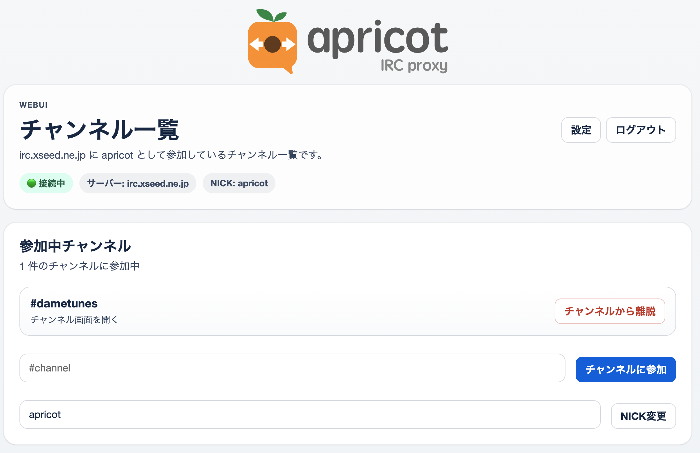
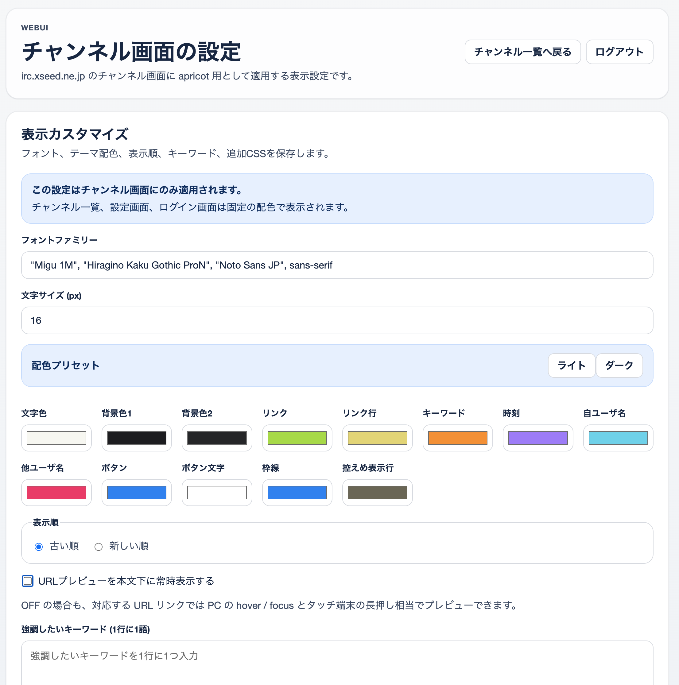
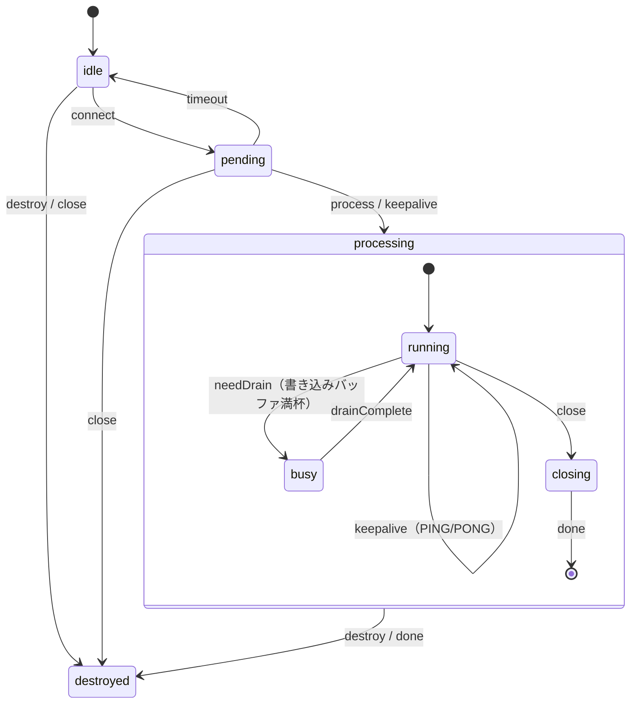

# apricot IRC Proxy


IRC サーバーへの永続接続を維持し、**ブラウザ・IRC クライアント・REST API**の 3 経路からチャットに参加できる IRC プロキシです。
Cloudflare Workers + Durable Objects で動作します。

長らくお世話になっていた Perl 製 IRC プロキシ「plum」を Cloudflare Workers で動かしてくれ、と Claude Code に頼んだらこれになりました。

---
## できること
- IRC サーバーへの永続接続（切断時も自動再接続）
- ブラウザでのチャットインターフェース（テーマカスタマイズ・キーワードハイライト対応）
- WebSocket 対応 IRC クライアントからの接続
- REST API 経由での操作（チャンネル参加・メッセージ投稿・nick 変更）
- URL 投稿時のページタイトル自動取得（Twitter/X oEmbed 対応）
- Web UI の URL 画像 / カードプレビュー（常時表示または hover / 長押し）

---

## プロキシ ID とは

apricot は **プロキシ ID** という識別子で IRC セッションを管理します。URL の `/proxy/<ID>/` の部分がプロキシ ID です。

```
https://example.workers.dev/proxy/alice/web/   ← "alice" がプロキシ ID
```

プロキシ ID ごとに IRC 接続・チャンネル状態・メッセージログ・表示設定が独立しています。1 つのデプロイで複数のプロキシ ID を使い分けられるため、複数人で共有する際はユーザーごとに異なるプロキシ ID を割り当てるだけで独立した IRC セッションを持てます。

初回アクセス時、プロキシ ID が IRC のニックネームとして自動設定されます（例: プロキシ ID が `alice` なら nick は `alice`）。

---

## クイックスタート（初回セットアップ）

### 1. 依存パッケージのインストール

```bash
cd workers
npm install
```

### 2. IRC サーバーの設定

`workers/wrangler.toml` の `[vars]` セクションに接続先を記述します:

```toml
[vars]
IRC_HOST = "irc.libera.chat"
IRC_PORT = "6667"
IRC_NICK = "apricotbot"
IRC_USER = "apricotbot"
IRC_REALNAME = "apricot IRC Proxy"
IRC_TLS = "false"
IRC_AUTO_CONNECT_ON_STARTUP = "true"
IRC_AUTO_RECONNECT_ON_DISCONNECT = "true"
IRC_AUTOJOIN = "#general,#test"
IRC_ENCODING = "iso-2022-jp"   # 日本語サーバーの場合
TIMEZONE_OFFSET = "9"           # JST (UTC+9)
ENABLE_REMOTE_URL_PREVIEW = "false"
```

> **補足**: `IRC_NICK` と `IRC_AUTOJOIN` は全プロキシ ID 共通のデフォルト値です。nick は初回アクセス時にプロキシ ID から自動設定されるため、1 人 1 プロキシ ID で使う場合は `IRC_NICK` の設定は不要です。プロキシ ID ごとに nick や autojoin を変えたい場合は `PUT /api/config` を使います。

API キーなど秘密情報は `.dev.vars`（ローカル開発用）に記述します（`.gitignore` 済み）:

```ini
API_KEY=your-local-api-key
IRC_PASSWORD=optional-server-password
CLIENT_PASSWORD=required-client-password
```

`CLIENT_PASSWORD` は Web UI と WebSocket 接続の必須パスワードです。
未設定の場合、`/web/*` と `/ws` は `503` を返します。

### 3. ローカルで起動する

```bash
npm run dev
```

`http://localhost:8787` で起動します。Durable Objects もローカルでエミュレートされます。

> **注意**: `cloudflare:sockets` による TCP 接続はローカル環境でも動作しますが、
> 接続先 IRC サーバーが `localhost` からのアクセスを許可している必要があります。

### 4. IRC サーバーへ接続する

```bash
curl -X POST http://localhost:8787/proxy/myproxy/api/connect \
  -H "Authorization: Bearer your-api-key"
```

接続は非同期で開始されます。状態を確認するには:

```bash
curl http://localhost:8787/proxy/myproxy/api/status \
  -H "Authorization: Bearer your-api-key"
```

レスポンス例:

```json
{
  "connected": true,
  "nick": "myproxy",
  "channels": ["#general", "#test"],
  "clients": 1,
  "serverName": "irc.libera.chat"
}
```

---

## 複数ユーザで使うには

プロキシ ID をユーザーごとに分けることで、1 つの Workers デプロイを複数人で共有できます。

```
Alice → https://.../proxy/alice/web/
Bob   → https://.../proxy/bob/web/
```

各プロキシ ID は独立した環境を持ちます:

- IRC 接続（nick は初回アクセス時にプロキシ ID から自動設定）
- チャンネル状態・メッセージログ
- Web UI の表示設定

**注意**: `CLIENT_PASSWORD` はデプロイ全体で 1 つだけ設定できます。プロキシ ID ごとにパスワードを分けることはできないため、全ユーザーが同じパスワードを共有します。また、IRC サーバーの接続設定（`IRC_HOST` 等）も全プロキシ ID で共通です。

---

## 利用シーン別ガイド

### ブラウザ（Web UI）から利用する

ブラウザで以下の URL を開きます（ローカル開発時）:

```
http://localhost:8787/proxy/myproxy/web/
```

> **注意**: Web UI を使うには `CLIENT_PASSWORD` の設定が必須です。未設定時は `503` を返します。

**チャンネル一覧画面**から参加中のチャンネルを選択すると、チャンネル画面に遷移します。

チャンネル画面では:
- メッセージの送受信
- URL の自動リンク化
- 更新があった時の自動反映
- 接続が不安定な場合の自動再同期

チャンネル一覧画面では:
- チャンネルへの参加・離脱
- ニックネームの変更
- 設定画面へのアクセス（パスワード設定時のみ）



#### Web UI の表示カスタマイズ

設定画面（`/proxy/:id/web/settings`）から以下を変更できます:

- **フォント・文字サイズ** — チャンネル画面のフォントファミリーとサイズ
- **配色テーマ** — 13 色のカラーピッカーによるテーマ設定。ライト／ダークのプリセットあり
- **表示順** — 古い順（asc）/ 新しい順（desc）の切り替え
- **URL プレビュー** — URL の画像 / カードプレビューを常時表示するか（OFF の場合は hover / 長押しで表示）
- **強調したいキーワード** — 指定語をハイライト表示
- **控えめ表示キーワード** — 指定語を含むメッセージを薄く表示
- **追加 CSS** — チャンネル画面専用の限定 CSS



設定内容はプロキシ ID ごとに保存され、チャンネル画面にのみ適用されます。追加 CSS は `<style>` へ直接埋め込まず、`/proxy/:id/web/theme.css` から別スタイルシートとして配信されます。
許可されるのは `.channel-shell` などの既定セレクタ配下と、色・余白・フォント・枠線などの見た目変更用プロパティだけです。`@import`、`url()`、`content:`、`html` / `body` / `iframe` / `*` を含むセレクタは拒否されます。

> **補足**: 設定画面も `CLIENT_PASSWORD` 設定時のみ利用できます。

---

### IRC クライアントから利用する

WebSocket 経由で標準 IRC クライアント（WeeChat、irssi 等）から接続できます。

> **注意**: WebSocket 接続にも `CLIENT_PASSWORD` の設定が必須です。未設定時は `503` を返します。

接続先:

```
ws://localhost:8787/proxy/myproxy/ws
```

クライアント側の設定例（WeeChat の場合）:

```
/server add apricot localhost/8787 -ssl=false
/set irc.server.apricot.addresses "localhost/8787"
/set irc.server.apricot.password "clientpassword"
/connect apricot
```

接続後はプロキシが既に参加しているチャンネルに自動的に同期（JOIN・TOPIC・NAMES を再送）されます。

---

### 外部スクリプト・API から利用する

プログラムから IRC チャンネルを操作する REST API です。
`Authorization: Bearer <API_KEY>` ヘッダーによる認証が必要です。

#### チャンネルに参加する

```bash
curl -X POST http://localhost:8787/proxy/myproxy/api/join \
  -H "Content-Type: application/json" \
  -H "Authorization: Bearer your-api-key" \
  -d '{"channel": "#general"}'
```

> **ヒント**: 接続時に自動参加させたい場合は、`wrangler.toml` の `IRC_AUTOJOIN` にチャンネルを指定してください。

#### チャンネルから離脱する

```bash
curl -X POST http://localhost:8787/proxy/myproxy/api/leave \
  -H "Content-Type: application/json" \
  -H "Authorization: Bearer your-api-key" \
  -d '{"channel": "#general"}'
```

#### メッセージを投稿する

```bash
curl -X POST http://localhost:8787/proxy/myproxy/api/post \
  -H "Content-Type: application/json" \
  -H "Authorization: Bearer your-api-key" \
  -d '{"channel": "#general", "message": "Hello from API!"}'
```

#### URL のメタデータを取得して投稿する

`message` の代わりに `url` を指定すると、ページタイトルを取得して投稿します。Web UI では、同じ URL から画像 / カードプレビューも保存されます:

```bash
curl -X POST http://localhost:8787/proxy/myproxy/api/post \
  -H "Content-Type: application/json" \
  -H "Authorization: Bearer your-api-key" \
  -d '{"channel": "#general", "url": "https://example.com/article"}'
```

- **Twitter/X URL**: oEmbed API で投稿本文と著者名を取得し、Web UI では画像がなくてもテキストカードとしてプレビュー
- **一般 URL**: HTML の `<title>` タグを取得（最初の 32KB のみ読み込み）
- フォールバック: URL をそのまま投稿

受信メッセージに含まれる URL の自動プレビュー解決は、既定では無効です。必要な場合だけ `ENABLE_REMOTE_URL_PREVIEW=true` を設定してください。
この制限は外部 fetch の濫用を抑えるためで、`POST /api/post` の `url` 指定による投稿は従来どおりメタデータ取得を行います。

Web UI の URL プレビュー優先順位:

1. 画像直リンクならそのままインライン画像として扱う
2. YouTube URL ならサムネイル画像を生成する
3. Twitter/X URL は oEmbed からテキストカードを生成する
4. それ以外は `og:image` → `twitter:image` → JSON oEmbed の順で画像を探す
5. 画像もテキストカードも生成できなければプレビューは表示しない

リクエストボディ:

| フィールド | 必須 | 説明 |
|------------|:----:|------|
| `channel` | ✅ | 投稿先チャンネル（例: `#general`） |
| `message` | △ | 投稿テキスト（`url` と排他） |
| `url` | △ | メタデータ取得元 URL（`message` と排他） |

#### nick を変更する

```bash
curl -X POST http://localhost:8787/proxy/myproxy/api/nick \
  -H "Content-Type: application/json" \
  -H "Authorization: Bearer your-api-key" \
  -d '{"nick": "apricot_alt"}'
```

> **補足**: サーバーの応答を待ってからレスポンスを返します。nick が使用中の場合は `433 ERR_NICKNAMEINUSE` 等のエラーメッセージが返ります。5 秒以内にサーバーが応答しない場合は `503` を返します。

#### プロキシ ID ごとの nick / autojoin を設定する

初回アクセス時に自動設定された nick や autojoin をプロキシ ID ごとに変えたい場合は `PUT /api/config` を使います:

```bash
curl -X PUT http://localhost:8787/proxy/myproxy/api/config \
  -H "Content-Type: application/json" \
  -H "Authorization: Bearer your-api-key" \
  -d '{"nick": "myproxy_alt", "autojoin": ["#general", "#random"]}'
```

ここで設定した値は**次回接続時のデフォルト**として保存されます。現在接続中の nick を即時変更したい場合は `POST /api/nick` を使ってください。`nick: null` または `autojoin: []` を送ると、その項目の保存値をクリアして共有デフォルトへ戻せます。

#### IRC サーバーから切断する

```bash
curl -X POST http://localhost:8787/proxy/myproxy/api/disconnect \
  -H "Authorization: Bearer your-api-key"
```

> **補足**: API での手動切断は `IRC_AUTO_RECONNECT_ON_DISCONNECT=true` でも自動再接続を行いません。

#### チャンネルのログを取得する

```bash
curl http://localhost:8787/proxy/myproxy/api/logs/%23general \
  -H "Authorization: Bearer your-api-key"
```

チャンネル名の `#` は `%23` にエンコードしてください。

レスポンス例:

```json
{
  "channel": "#general",
  "messages": [
    {"time": 1712160000000, "type": "privmsg", "nick": "alice", "text": "hello!"},
    {"time": 1712160010000, "type": "privmsg", "nick": "apricotbot", "text": "hi there", "embed": {"kind": "card", "sourceUrl": "https://example.com/post", "imageUrl": "https://example.com/card.jpg", "title": "Example", "siteName": "example.com"}}
  ]
}
```

`messages` の各オブジェクト:

| フィールド | 型 | 説明 |
|------------|-----|------|
| `time` | number | Unix ミリ秒 |
| `type` | string | `privmsg` / `notice` / `join` / `part` / `quit` / `kick` / `nick` / `topic` / `mode` / `self` |
| `nick` | string | 発言者 nick |
| `text` | string | メッセージ本文（`nick` / `topic` 等では対象または新しい値） |
| `embed` | object? | Web UI 用の URL プレビュー情報。`kind`, `sourceUrl`, `imageUrl?`, `title?`, `siteName?`, `description?` を含む |

最大 200 件（時系列順）を返します。指定チャンネルのバッファが存在しない場合は `404` を返します。

Web UI 設定画面では、URL プレビューを本文下に常時表示するかを切り替えられます。OFF の場合でも、対応する URL リンクでは PC の hover / focus とタッチ端末の長押し相当でプレビューできます。

---

## Cloudflare へのデプロイ

### 1. Wrangler にログインする

```bash
npx wrangler login
```

### 2. Secrets を設定する

秘密情報は Wrangler のシークレット機能で設定します:

```bash
npx wrangler secret put API_KEY
npx wrangler secret put IRC_PASSWORD        # 必要な場合のみ
npx wrangler secret put CLIENT_PASSWORD      # 必要な場合のみ
```

### 3. デプロイする

```bash
npm run deploy
```

### デプロイ後の URL

```
https://apricot.<your-subdomain>.workers.dev/proxy/myproxy/web/
```

---

## 技術リファレンス

### 環境変数一覧

| 環境変数 | 必須 | デフォルト | 説明 |
|----------|:----:|-----------|------|
| `IRC_HOST` | ✅ | ─ | IRC サーバーホスト名 |
| `IRC_PORT` | ─ | `6667` | IRC サーバーポート（レンジ・複数指定可、例: `6660-6669` や `6660,6667,6697`） |
| `IRC_NICK` | ─ | `apricot` | IRC ニックネームのフォールバック値。実際の nick は初回アクセス時にプロキシ ID から自動設定される |
| `IRC_USER` | ─ | `apricot` | IRC ユーザー名 |
| `IRC_REALNAME` | ─ | `apricot IRC Proxy` | IRC リアルネーム |
| `IRC_TLS` | ─ | `false` | IRC サーバーへの TCP 接続に TLS を使用（`true` / `false`） |
| `IRC_PASSWORD` | ─ | ─ | IRC サーバーパスワード（secret 推奨） |
| `CLIENT_PASSWORD` | ─ | ─ | WebSocket クライアント接続と Web UI ログインの共通パスワード。未設定時は `/web/*` と `/ws` が `503` を返す |
| `IRC_AUTO_CONNECT_ON_STARTUP` | ─ | `false` | Durable Object インスタンス起動時に IRC へ接続開始 |
| `IRC_AUTO_RECONNECT_ON_DISCONNECT` | ─ | `false` | IRC 切断時に 5 秒後の自動再接続を有効化（API 手動切断時は抑制） |
| `IRC_AUTOJOIN` | ─ | ─ | 自動参加チャンネルのデフォルト値（カンマ区切り、例: `#general,#test`）。プロキシ ID ごとに `PUT /api/config` で上書き可能 |
| `IRC_ENCODING` | ─ | `utf-8` | IRC サーバーの文字コード（例: `iso-2022-jp`、`euc-jp`、`shift_jis`） |
| `ENABLE_REMOTE_URL_PREVIEW` | ─ | `false` | 受信 IRC メッセージに含まれる URL の自動プレビュー解決を有効化 |
| `KEEPALIVE_INTERVAL` | ─ | `60` | DO keepalive 間隔（秒） |
| `TIMEZONE_OFFSET` | ─ | `9` | Web UI の時刻表示オフセット（時間単位、例: JST は `9`） |
| `WEB_LOG_MAX_LINES` | ─ | `200` | チャンネルごとのログ保持件数 |
| `API_KEY` | ✅ | ─ | 外部 API 認証キー（secret 必須） |

> **補足**: `IRC_AUTO_CONNECT_ON_STARTUP` の「起動時」は、Cloudflare Workers 全体の起動ではなく、各プロキシ ID の Durable Object インスタンスが最初のリクエストや WebSocket 接続で起動したタイミングを指します。

### プロキシ ID について

プロキシは **プロキシ ID** 単位で独立した Durable Object インスタンスを持ちます。
任意の文字列をプロキシ ID として使用できます（例: `myproxy`、`main`）。
全インスタンスが同じ環境変数設定を共有しますが、IRC 接続やチャンネル状態は独立しています。

nick の決定順序（高い方が優先）:
1. `PUT /api/config` で保存したプロキシ ID ごとの nick
2. 初回アクセス時にプロキシ ID から自動生成した nick（例: `alice` → nick `alice`）
3. `wrangler.toml` の `IRC_NICK`

### API エンドポイント一覧

| メソッド | パス | 認証 | 説明 |
|----------|------|:----:|------|
| `GET` | `/` または `/health` | ─ | ヘルスチェック |
| `GET` | `/proxy/:id/ws` | IRC `PASS` | WebSocket 接続（IRC クライアント用、`CLIENT_PASSWORD` 必須） |
| `GET` | `/proxy/:id/web/` | Cookie | チャンネル一覧ページ（`CLIENT_PASSWORD` 必須） |
| `GET` | `/proxy/:id/web/login` | ─ | Web UI ログイン画面（`CLIENT_PASSWORD` 必須） |
| `POST` | `/proxy/:id/web/login` | ─ | Web UI ログイン（`CLIENT_PASSWORD` 必須） |
| `POST` | `/proxy/:id/web/logout` | ─ | Web UI ログアウト |
| `GET` | `/proxy/:id/web/settings` | Cookie | Web UI 表示設定ページ |
| `POST` | `/proxy/:id/web/settings` | Cookie | Web UI 設定保存 |
| `POST` | `/proxy/:id/web/join` | Cookie | Web UI チャンネル参加 |
| `POST` | `/proxy/:id/web/leave` | Cookie | Web UI チャンネル離脱 |
| `POST` | `/proxy/:id/web/nick` | Cookie | Web UI ニックネーム変更 |
| `GET` | `/proxy/:id/web/theme.css` | Cookie | チャンネル画面専用のカスタム CSS |
| `GET` | `/proxy/:id/web/:channel` | Cookie | チャンネルシェルページ |
| `GET` | `/proxy/:id/web/:channel/messages` | Cookie | メッセージ一覧フレーム |
| `GET` | `/proxy/:id/web/:channel/messages/fragment` | Cookie | メッセージ一覧の HTML 断片（Web UI 内部更新用） |
| `GET` | `/proxy/:id/web/:channel/updates` | Cookie | メッセージ更新通知用 WebSocket（Web UI 内部用） |
| `GET` | `/proxy/:id/web/:channel/composer` | Cookie | 入力フォームフレーム |
| `POST` | `/proxy/:id/web/:channel/composer` | Cookie | Web フォームからメッセージ送信 |
| `POST` | `/proxy/:id/api/connect` | Bearer | IRC サーバーへ接続 |
| `POST` | `/proxy/:id/api/disconnect` | Bearer | IRC サーバー手動切断 |
| `POST` | `/proxy/:id/api/join` | Bearer | チャンネル参加 |
| `POST` | `/proxy/:id/api/leave` | Bearer | チャンネル離脱 |
| `POST` | `/proxy/:id/api/post` | Bearer | 外部投稿 |
| `POST` | `/proxy/:id/api/nick` | Bearer | nick 即時変更（IRC NICKコマンド送信） |
| `PUT` | `/proxy/:id/api/config` | Bearer | プロキシ ID ごとの nick / autojoin を保存 |
| `GET` | `/proxy/:id/api/logs/:channel` | Bearer | チャンネルログ取得 |
| `GET` | `/proxy/:id/api/status` | Bearer | 接続状態確認 |
| `OPTIONS` | `/proxy/:id/api/*` | ─ | CORS プリフライト |

> **補足**: `/api/*` は `OPTIONS` を除いて常に Bearer 認証が必要です。`API_KEY` 未設定時は `503` を返します。
> **補足**: `/web/*` と `/ws` は `CLIENT_PASSWORD` 未設定時に `503` を返します。

### Web UI の URL 構造

| URL | 説明 |
|-----|------|
| `/proxy/:id/web/` | 参加中チャンネル一覧 |
| `/proxy/:id/web/login` | ログイン画面 |
| `/proxy/:id/web/settings` | 表示設定 |
| `/proxy/:id/web/theme.css` | チャンネル画面専用のカスタム CSS |
| `/proxy/:id/web/:channel` | チャンネルシェル画面（iframe 構成） |
| `/proxy/:id/web/:channel/messages` | メッセージ一覧フレーム |
| `/proxy/:id/web/:channel/messages/fragment` | メッセージ一覧の HTML 断片。iframe 内の Fetch 更新で使用 |
| `/proxy/:id/web/:channel/updates` | メッセージ更新通知を受ける WebSocket |
| `/proxy/:id/web/:channel/composer` | 入力フォームフレーム |

### Web UI の更新内部ルート

チャンネル画面のメッセージ領域は、以下の Web UI 内部ルートを使って更新されます。
これらはブラウザ表示用の内部エンドポイントで、外部連携向け API ではありません。

- `GET /proxy/:id/web/:channel/messages/fragment` — メッセージ一覧部分だけを返す HTML 断片
- `GET /proxy/:id/web/:channel/updates` — メッセージ更新通知を受ける WebSocket

通常は `updates` の通知を受けた時だけ `messages/fragment` を Fetch し、通知用 WebSocket が切断中のときだけ 30 秒間隔で再同期します。

---

## 開発者向け情報

### ローカル開発コマンド

```bash
npm run dev      # ローカル開発サーバー起動
npm run check    # TypeScript 型チェック
npm test         # テスト実行（Vitest）
npm run deploy   # Cloudflare Workers へデプロイ
```

### アーキテクチャ

```
ブラウザ (HTTP)
IRC クライアント (WebSocket)  ──→  Cloudflare Worker (index.ts)
外部スクリプト (REST API)                    │
                                    Durable Object: IrcProxyDO
                                            │
                                    cloudflare:sockets (TCP)
                                            │
                                      IRC サーバー
```

### モジュール構成

| ファイル | 役割 |
|----------|------|
| `src/index.ts` | Worker エントリポイント・ルーティング・API 認証 |
| `src/irc-proxy.ts` | Durable Object 本体（状態管理・WebSocket・HTTP ハンドラ） |
| `src/irc-connection.ts` | IRC サーバーへの TCP ソケット接続（状態マシン: idle → pending → processing → destroyed） |
| `src/irc-parser.ts` | IRC メッセージのパース・ビルド（IRCv3 タグ対応） |
| `src/proxy-config.ts` | 型付き環境変数パース |
| `src/module-system.ts` | plum 互換モジュールシステム（`ss_*` / `cs_*` イベント） |
| `src/modules/ping.ts` | PING/PONG 自動応答 |
| `src/modules/channel-track.ts` | JOIN/PART/KICK/QUIT/NICK によるチャンネル状態追跡 |
| `src/modules/client-sync.ts` | 新規クライアント接続時の状態リプレイ |
| `src/modules/web.ts` | Web チャットインターフェース・メッセージバッファ・DO ストレージ永続化 |
| `src/modules/url-metadata.ts` | URL メタデータ抽出と Web UI プレビュー解決（画像直リンク・YouTube・OGP / Twitter Card / oEmbed） |

### IRC 接続状態遷移




### 常駐しているように見せる仕組み

IRC 接続確立後に Durable Object が `storage.setAlarm()` で次回の keepalive を予約し、`alarm()` ハンドラが起動するたびに再び次回アラームを登録します。

```text
IRC 接続完了
  ↓
KEEPALIVE_INTERVAL 秒後に Alarm を予約
  ↓
alarm() 発火
  ↓
IRC 接続中なら次回 Alarm を再予約
  ↓
この繰り返しで DO に定期イベントを入れ続ける
```

Durable Object が「完全に常駐している」わけではなく、アイドル退避される前に定期的なイベントを入れることで、同じインスタンスと in-memory 状態を維持しやすくしています。切断時には Alarm を停止します。

Cloudflare のデプロイ、ランタイム更新、配置変更などでは Durable Object が再生成される可能性があるため、永続稼働が保証されるわけではありません。そのため再接続やログ復元を前提に設計しています。

`KEEPALIVE_INTERVAL` は短すぎると invocation 数が増え、長すぎると次の Alarm より先に退避されるリスクがあります。運用時は接続安定性とコストのバランスを見ながら調整してください。

## 前提技術

- Perl 製 IRC プロキシ「plum」を **Cloudflare Workers + Durable Objects** で実装した TypeScript 版
- [Node.js](https://nodejs.org/) 18 以上
- [Wrangler CLI](https://developers.cloudflare.com/workers/wrangler/) v3（`npm install -D wrangler` で導入済み）
- Cloudflare アカウント（デプロイ時のみ）
