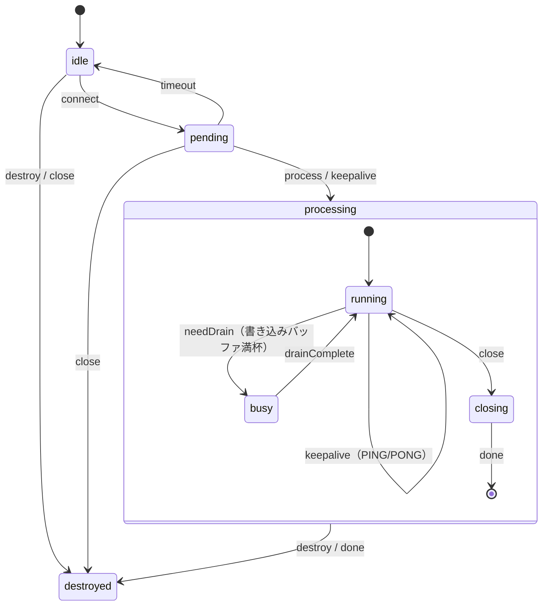

# apricot IRC Proxy

Perl 製 IRC プロキシ「plum」を **Cloudflare Workers + Durable Objects** で実装した TypeScript 版です。
IRC サーバーへの永続接続を維持しつつ、WebSocket・Web ブラウザ・外部 API の 3 経路からチャットに参加できます。

---

## アーキテクチャ概要

```
ブラウザ (HTTP)
IRC クライアント (WebSocket)  ──→  Cloudflare Worker (index.ts)
外部スクリプト (REST API)                    │
                                    Durable Object: IrcProxyDO
                                            │
                                    cloudflare:sockets (TCP)
                                            │
                                      IRC サーバー
```

### モジュール構成

| ファイル | 役割 |
|----------|------|
| `src/index.ts` | Worker エントリポイント・ルーティング・API 認証 |
| `src/irc-proxy.ts` | Durable Object 本体（状態管理・WebSocket・HTTP ハンドラ） |
| `src/irc-connection.ts` | IRC サーバーへの TCP ソケット接続 |
| `src/irc-parser.ts` | IRC メッセージのパース・ビルド（IRCv3 タグ対応） |
| `src/module-system.ts` | plum 互換モジュールシステム（`ss_*` / `cs_*` イベント） |
| `src/modules/ping.ts` | PING/PONG 自動応答 |
| `src/modules/channel-track.ts` | JOIN/PART/KICK/QUIT/NICK によるチャンネル状態追跡 |
| `src/modules/client-sync.ts` | 新規クライアント接続時の状態リプレイ |
| `src/modules/web.ts` | Web チャットインターフェース・メッセージバッファ |
| `src/modules/url-metadata.ts` | URL メタデータ抽出（Twitter/X oEmbed・HTML title） |

### IRC 接続状態遷移



---

## 前提条件

- [Node.js](https://nodejs.org/) 18 以上
- [Wrangler CLI](https://developers.cloudflare.com/workers/wrangler/) v3（`npm install -D wrangler` で導入済み）
- Cloudflare アカウント（デプロイ時のみ）

---

## セットアップ

```bash
cd workers
npm install
```

---

## ローカル開発

```bash
npm run dev
```

`http://localhost:8787` で起動します。Durable Objects もローカルでエミュレートされます。

> **注意**: `cloudflare:sockets` による TCP 接続はローカル環境でも動作しますが、
> 接続先 IRC サーバーが `localhost` からのアクセスを許可している必要があります。

型チェック:

```bash
npm run check
```

テスト実行:

```bash
npm test
```

---

## 設定方法

プロキシの設定は **環境変数** で行います。`wrangler.toml` の `[vars]` セクションに通常の設定値を、秘密情報は Wrangler secrets またはローカル開発用の `.dev.vars` に記述します。

### 環境変数一覧

| 環境変数 | 必須 | デフォルト | 説明 |
|----------|:----:|-----------|------|
| `IRC_HOST` | ✅ | ─ | IRC サーバーホスト名 |
| `IRC_PORT` | ─ | `6667` | IRC サーバーポート（レンジ・複数指定可、例: `6660-6669` や `6660,6667,6697`） |
| `IRC_NICK` | ─ | `apricot` | IRC ニックネーム |
| `IRC_USER` | ─ | `apricot` | IRC ユーザー名 |
| `IRC_REALNAME` | ─ | `apricot IRC Proxy` | IRC リアルネーム |
| `IRC_TLS` | ─ | `false` | TLS 使用（`true` / `false`） |
| `IRC_PASSWORD` | ─ | ─ | IRC サーバーパスワード（secret 推奨） |
| `CLIENT_PASSWORD` | ─ | ─ | WebSocket クライアント接続と Web UI ログインの共通パスワード（secret 推奨） |
| `IRC_AUTO_CONNECT_ON_STARTUP` | ─ | `false` | Durable Object インスタンス起動時に IRC へ接続開始 |
| `IRC_AUTO_RECONNECT_ON_DISCONNECT` | ─ | `false` | IRC 切断時に 5 秒後の自動再接続を有効化 |
| `IRC_AUTOJOIN` | ─ | ─ | 自動参加チャンネル（カンマ区切り、例: `#general,#test`） |
| `KEEPALIVE_INTERVAL` | ─ | `50` | DO keepalive 間隔（秒）。IRC 接続中に DO 退避を防止 |
| `IRC_ENCODING` | ─ | `utf-8` | IRC サーバーの文字コード（例: `iso-2022-jp`、`euc-jp`、`shift_jis`） |
| `TIMEZONE_OFFSET` | ─ | `0` | Web UI の時刻表示オフセット（時間単位、例: JST は `9`） |
| `API_KEY` | ✅ | ─ | 外部 API 認証キー（secret 必須） |

> **補足**: `IRC_AUTO_CONNECT_ON_STARTUP` の「起動時」は、Cloudflare Workers 全体の起動ではなく、各プロキシ ID の Durable Object インスタンスが最初のリクエストや WebSocket 接続で起動したタイミングを指します。

### wrangler.toml の設定例

```toml
[vars]
IRC_HOST = "irc.libera.chat"
IRC_PORT = "6667"
IRC_NICK = "apricotbot"
IRC_USER = "apricotbot"
IRC_REALNAME = "apricot IRC Proxy"
IRC_TLS = "false"
IRC_AUTO_CONNECT_ON_STARTUP = "true"
IRC_AUTO_RECONNECT_ON_DISCONNECT = "true"
IRC_AUTOJOIN = "#general,#test"
IRC_ENCODING = "iso-2022-jp"   # 日本語サーバーの場合
TIMEZONE_OFFSET = "9"           # JST (UTC+9)
```

### ローカル開発用（.dev.vars）

秘密情報はリポジトリにコミットせず `.dev.vars` に記述します（`.gitignore` 済み）:

```ini
API_KEY=your-local-api-key
IRC_PASSWORD=optional-server-password
CLIENT_PASSWORD=optional-client-password
IRC_AUTO_CONNECT_ON_STARTUP=true
IRC_AUTO_RECONNECT_ON_DISCONNECT=true
# wrangler.toml の [vars] をオーバーライドすることも可能
IRC_HOST=irc.libera.chat
IRC_NICK=apricotdev
```

### 本番環境の Secrets 設定

```bash
npx wrangler secret put API_KEY
npx wrangler secret put IRC_PASSWORD        # 必要な場合のみ
npx wrangler secret put CLIENT_PASSWORD      # 必要な場合のみ
```

### プロキシ ID

プロキシは **プロキシ ID** 単位で独立した Durable Object インスタンスを持ちます。
任意の文字列をプロキシ ID として使用できます（例: `myproxy`、`main`）。
全インスタンスが同じ環境変数設定を共有しますが、IRC 接続やチャンネル状態は独立しています。

### IRC サーバーへ接続する

```bash
curl http://localhost:8787/proxy/myproxy/connect \
  -H "Authorization: Bearer your-api-key"
```

接続は非同期で開始されます。状態確認:

```bash
curl http://localhost:8787/proxy/myproxy/status
```

レスポンス例:

```json
{
  "connected": true,
  "nick": "apricotbot",
  "channels": ["#general", "#test"],
  "clients": 1,
  "serverName": "irc.libera.chat"
}
```

---

## Web インターフェース

ブラウザで以下の URL を開きます（ローカル開発時）:

```
http://localhost:8787/proxy/myproxy/web/
```

| URL | 説明 |
|-----|------|
| `/proxy/:id/web/` | 参加中チャンネル一覧 |
| `/proxy/:id/web/:channel` | チャンネルのメッセージ表示・送信フォーム |

- メッセージは最新 200 件をインメモリに保持（新しい順に表示）
- Web UI のログは Durable Object storage にも保存され、DO 再起動後も再接続して同じチャンネルに参加すると表示を復元
- 保存済みログだけではチャンネル一覧は増えず、再参加したチャンネルのみ一覧に表示
- `CLIENT_PASSWORD` を設定すると Web UI もログイン必須になり、未設定時は従来どおり公開
- 30 秒ごとに自動リフレッシュ（入力中は停止）
- ダーク／ライトモード自動切替（`prefers-color-scheme` 対応）
- URL は自動リンク化
- `TIMEZONE_OFFSET` で時刻表示のタイムゾーンを設定可能（デフォルト UTC）

### Web UI ログイン

`CLIENT_PASSWORD` が設定されている場合、`/proxy/:id/web/login` でログインしてから Web UI を利用します。
認証は proxy ID ごとの HttpOnly Cookie で保持されます。

---

## IRC クライアントからの接続

WebSocket 経由で標準 IRC クライアント（WeeChat、irssi 等）から接続できます。

接続先:

```
ws://localhost:8787/proxy/myproxy/ws
```

クライアント側の設定例（WeeChat の場合）:

```
/server add apricot localhost/8787 -ssl=false
/set irc.server.apricot.addresses "localhost/8787"
/set irc.server.apricot.password "clientpassword"   ← config の password を設定した場合
/connect apricot
```

接続後はプロキシが既に参加しているチャンネルに自動的に同期（JOIN・TOPIC・NAMES を再送）されます。

---

## 外部投稿 API

プログラムから IRC チャンネルにメッセージを投稿する REST API です。
`Authorization: Bearer <API_KEY>` ヘッダーによる認証が必要です。

### チャンネル参加

```bash
curl -X POST http://localhost:8787/proxy/myproxy/api/join \
  -H "Content-Type: application/json" \
  -H "Authorization: Bearer your-api-key" \
  -d '{"channel": "#general"}'
```

レスポンス例:

```json
{"ok": true, "channel": "#general"}
```

> **ヒント**: 接続時に自動参加させたい場合は、`POST /config` の `autojoin` フィールドにチャンネルを指定してください。

### メッセージ投稿

```bash
curl -X POST http://localhost:8787/proxy/myproxy/api/post \
  -H "Content-Type: application/json" \
  -H "Authorization: Bearer your-api-key" \
  -d '{"channel": "#general", "message": "Hello from API!"}'
```

### URL メタデータ自動抽出

`message` の代わりに `url` を指定すると、ページタイトルを取得して投稿します:

```bash
curl -X POST http://localhost:8787/proxy/myproxy/api/post \
  -H "Content-Type: application/json" \
  -H "Authorization: Bearer your-api-key" \
  -d '{"channel": "#general", "url": "https://example.com/article"}'
```

- **Twitter/X URL**: oEmbed API でツイート本文と著者名を取得
- **一般 URL**: HTML の `<title>` タグを取得（最初の 32KB のみ読み込み）
- フォールバック: URL をそのまま投稿

リクエストボディ:

| フィールド | 必須 | 説明 |
|------------|:----:|------|
| `channel` | ✅ | 投稿先チャンネル（例: `#general`） |
| `message` | △ | 投稿テキスト（`url` と排他） |
| `url` | △ | メタデータ取得元 URL（`message` と排他） |

レスポンス例:

```json
{"ok": true, "message": "記事タイトル https://...", "channel": "#general"}
```

### nick 変更

```bash
curl -X POST http://localhost:8787/proxy/myproxy/api/nick \
  -H "Content-Type: application/json" \
  -H "Authorization: Bearer your-api-key" \
  -d '{"nick": "apricot_alt"}'
```

レスポンス例:

```json
{"ok": true, "nick": "apricot_alt"}
```

> **補足**: API は IRC サーバーへ `NICK` コマンドを送信します。実際の現在 nick は、サーバーからの `NICK` 応答を受信した時点で更新されます。

### 切断

```bash
curl -X POST http://localhost:8787/proxy/myproxy/api/disconnect \
  -H "Authorization: Bearer your-api-key"
```

レスポンス例:

```json
{"ok": true}
```

> **補足**: API での手動切断は `IRC_AUTO_RECONNECT_ON_DISCONNECT=true` でも自動再接続を行いません。

---

## デプロイ

### Cloudflare へのデプロイ

```bash
npm run deploy
```

初回デプロイ前に Wrangler へのログインが必要です:

```bash
npx wrangler login
```

### 環境変数の設定

秘密情報は Wrangler のシークレット機能で設定します（詳細は「設定方法」セクションを参照）:

```bash
npx wrangler secret put API_KEY
npx wrangler secret put IRC_PASSWORD        # 必要な場合のみ
npx wrangler secret put CLIENT_PASSWORD      # 必要な場合のみ
```

### デプロイ後の URL

```
https://apricot.<your-subdomain>.workers.dev/proxy/myproxy/web/
```

---

## API エンドポイント一覧

| メソッド | パス | 認証 | 説明 |
|----------|------|:----:|------|
| `GET` | `/` または `/health` | ─ | ヘルスチェック |
| `GET` | `/proxy/:id/connect` | ✅ Bearer | IRC サーバーへ接続 |
| `GET` | `/proxy/:id/ws` | ─ | WebSocket 接続（IRC クライアント用） |
| `GET` | `/proxy/:id/status` | ─ | 接続状態確認 |
| `GET` | `/proxy/:id/web/` | ─ | チャンネル一覧ページ |
| `GET` | `/proxy/:id/web/:channel` | ─ | チャンネルページ |
| `GET` | `/proxy/:id/web/login` | ─ | Web UI ログイン画面 |
| `POST` | `/proxy/:id/web/login` | ─ | Web UI ログイン |
| `POST` | `/proxy/:id/web/logout` | ─ | Web UI ログアウト |
| `POST` | `/proxy/:id/web/:channel` | ─ | Web フォームからメッセージ送信 |
| `POST` | `/proxy/:id/api/join` | ✅ Bearer | チャンネル参加 API |
| `POST` | `/proxy/:id/api/post` | ✅ Bearer | 外部投稿 API |
| `POST` | `/proxy/:id/api/nick` | ✅ Bearer | nick 変更 API |
| `POST` | `/proxy/:id/api/disconnect` | ✅ Bearer | IRC サーバー手動切断 API |
| `OPTIONS` | `/proxy/:id/api/*` | ─ | CORS プリフライト |
