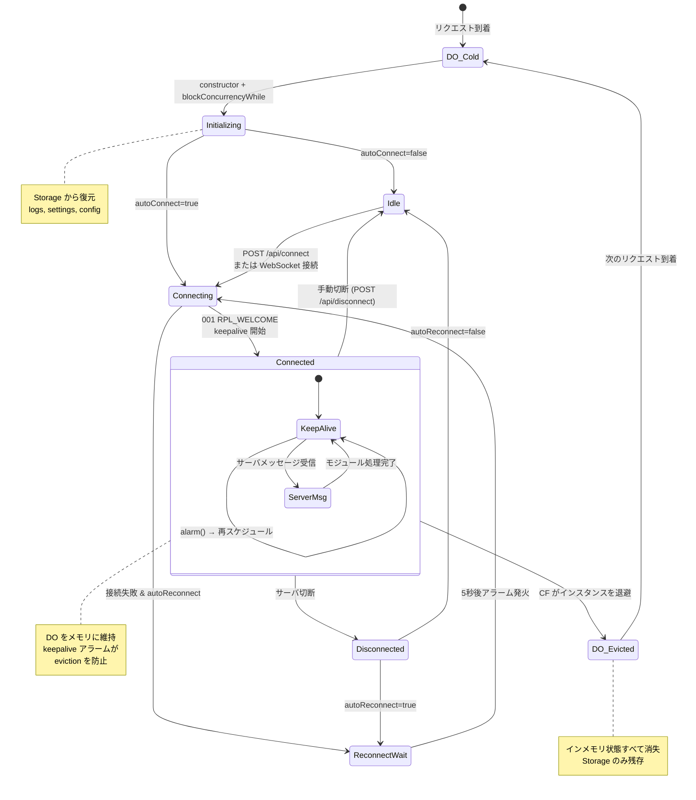

# apricot データフロー & 接続ライフサイクル

apricot の内部動作を、接続の各フェーズにおけるデータの流れと状態管理の観点から解説する技術資料です。

---

## 目次

1. [全体アーキテクチャ](#全体アーキテクチャ)
2. [DO の状態マップ — インメモリ vs 永続化](#do-の状態マップ--インメモリ-vs-永続化)
3. [初回接続フロー](#初回接続フロー)
4. [2 回目以降の接続（DO 存続中）](#2-回目以降の接続do-存続中)
5. [クライアント接続時の状態同期](#クライアント接続時の状態同期)
6. [Alarm と keepalive の仕組み](#alarm-と-keepalive-の仕組み)
7. [切断フロー](#切断フロー)
8. [DO 再生成後の復旧フロー](#do-再生成後の復旧フロー)
9. [状態の一生 — ライフサイクルまとめ](#状態の一生--ライフサイクルまとめ)

---

## 全体アーキテクチャ

```
┌──────────────────────────────────────────────────────────┐
│  クライアント層                                                                                                    │
│    ┌──────────┐    ┌───────────────┐    ┌──────────────────┐      │
│    │ ブラウザ           │    │ IRC クライアント             │    │ 外部スクリプト                     │      │
│    │ (Web UI)           │    │ (WebSocket)                  │    │ (REST API)                         │      │
│    └────┬─────┘    └──────┬────────┘    └───────┬──────────┘      │
│              │HTTP/WS                       │WS                                    │HTTP                        │
└───────┼───────────────┼───────────────────┼──────────────┘
                │                              │                                      │
┌───────▼───────────────▼───────────────────▼──────────────┐
│  Worker エントリ (index.ts)                                                                                        │
│  - URL ルーティング (/proxy/:id/...)                                                                               │
│  - Bearer 認証 (API) / Cookie 認証 (Web)                                                                           │
│  - proxyId → env.IRC_PROXY.idFromName(proxyId) で DO 特定                                                         │
└──────────────────────┬───────────────────────────────────┘
                                              │ request 転送
                                              │ (X-Proxy-Id, X-Proxy-Prefix ヘッダ付与)
┌──────────────────────▼───────────────────────────────────┐
│  Durable Object: IrcProxyDO (irc-proxy.ts)                                                                         │
│  ┌─────────────────────────────────────────────────────┐    │
│  │ インメモリ状態                                                                                           │    │
│  │  - serverConn (TCP)    - clients (WebSocket set)                                                         │    │
│  │  - channelStates       - nick / channels                                                                 │    │
│  │  - web store (msg buf) - channelRevisions                                                                │    │
│  └─────────────────────────────────────────────────────┘    │
│  ┌─────────────────────────────────────────────────────┐    │
│  │ DO Storage (永続化)                                                                                      │    │
│  │  - proxy:id            - proxy:config:v1                                                                 │    │
│  │  - web:logs:v1         - web:ui-settings:v1                                                              │    │
│  └─────────────────────────────────────────────────────┘    │
│  ┌─────────────────────────────────────────────────────┐    │
│  │ モジュール (module-system.ts)                                                                            │    │
│  │  ping → web → channelTrack → clientSync                                                               │    │
│  └─────────────────────────────────────────────────────┘    │
└──────────────────────┬───────────────────────────────────┘
                                              │ cloudflare:sockets (TCP)
┌──────────────────────▼───────────────────────────────────┐
│  IRC サーバー                                                                                                      │
└──────────────────────────────────────────────────────────┘
```

---

## DO の状態マップ — インメモリ vs 永続化

apricot のデータは「インメモリのみ」と「Storage に永続化」の 2 層に分かれます。この違いが DO のライフサイクルにおける挙動の違いに直結します。

### Storage に永続化されるデータ

| Storage キー | 型 | 内容 | 書き込みタイミング |
|---|---|---|---|
| `proxy:id` | `string` | プロキシ ID | 初回リクエスト時 |
| `proxy:config:v1` | `{ nick?, autojoin? }` | per-proxy の nick / autojoin | `PUT /api/config` |
| `web:logs:v1` | `Record<string, StoredMessage[]>` | チャンネルメッセージ履歴 | メッセージ追加ごと + サーバ切断時 |
| `web:ui-settings:v1` | `WebUiSettings` | テーマ・表示設定 | 設定画面 POST |

### インメモリのみのデータ（DO 再生成で消失）

| データ | 説明 |
|---|---|
| `serverConn` | IRC サーバへの TCP ソケット接続 |
| `clients` | 接続中 WebSocket クライアントの Set |
| `channelStates` | チャンネルごとのメンバーリスト・トピック |
| `channels` | 参加中チャンネル名の配列 |
| `nick` | 現在の IRC ニックネーム (実行時に解決) |
| `serverName` | 接続先サーバ名 (001 応答から取得) |
| `channelRevisions` | Web UI 更新通知用のリビジョン番号 |
| `webUpdateSubscribers` | Web UI 更新通知の WebSocket 購読者 |
| `connectPromise` | 接続 Promise (重複防止用) |
| `suppressAutoReconnectOnClose` | 手動切断フラグ |

---

## 初回接続フロー

「まだ一度も使われたことがない proxyId でアクセスした場合」の流れです。

```
[リクエスト到着]
       │
       ▼
  index.ts: URL パース
  proxyId = "alice" を抽出
  env.IRC_PROXY.idFromName("alice") で DO ID を生成
  X-Proxy-Id: alice ヘッダを付与して DO に転送
       │
       ▼
  IrcProxyDO.constructor()
  ├─ buildProxyConfigFromEnv(env) → envConfig 構築
  ├─ nick = envConfig.server.nick ("apricot" or IRC_NICK)
  ├─ モジュール登録: ping → web → channelTrack → clientSync
  └─ blockConcurrencyWhile: Storage から設定・ログを読み込み
     ├─ loadPersistedWebLogs()    → 初回は空
     └─ loadPersistedWebUiSettings() → 初回は空
       │
       ▼
  IrcProxyDO.fetch()
  ├─ ensureProxyConfigInitialized(request)  ← 初回のみ実行
  │    ├─ proxyId = "alice" を Storage に保存  ← proxy:id
  │    ├─ Storage から proxy:config:v1 を読み込み  ← 初回は null
  │    └─ resolveProxyConfig() で最終設定を決定
  │         └─ resolveNickValue():
  │              1. instanceConfig.nick → null (初回)
  │              2. sanitizeNick("alice") → "alice" ← これが採用
  │              3. envConfig.server.nick (フォールバック)
  │
  ├─ handleStartupAutoConnect()  ← 初回のみ実行
  │    └─ autoConnectOnStartup == true の場合
  │         └─ ensureServerConnection() を呼ぶ
  │
  └─ ルーティング処理へ
```

### IRC 接続の確立（ensureServerConnection → connectToServer）

```
  connectToServer()
       │
       ▼
  IrcServerConnection.connect()
  ├─ cloudflare:sockets connect(host, port) で TCP 確立
  ├─ readLoop() をバックグラウンド起動
  ├─ PASS <password>  (設定時のみ)
  ├─ NICK alice
  └─ USER alice 0 * :apricot IRC Proxy
       │
       ▼
  サーバ応答: 001 RPL_WELCOME
       │
       ▼
  handleServerMessage()
  ├─ markConnected() → _connected = true
  ├─ serverName = 応答から取得
  ├─ nick = params[0] (サーバが割り当てた nick)
  ├─ onServerOpen ライフサイクルをディスパッチ
  │    └─ 各モジュールの初期化処理
  ├─ scheduleKeepaliveAlarm()
  │    └─ storage.setAlarm(Date.now() + keepaliveMs)
  └─ autojoin チャンネルに JOIN 送信
       │
       ▼
  サーバ応答: JOIN, 332 (TOPIC), 353 (NAMES), 366 (END OF NAMES)
       │
       ▼
  各モジュールで処理
  ├─ channelTrack: channelStates に追加、channels 更新
  └─ web: メッセージバッファに JOIN を記録、Storage に永続化
```

### nick 決定の優先順位

```
優先度 高 ──────────────────────────────────────── 低

  PUT /api/config で     sanitizeNick      IRC_NICK       フォールバック
  保存した nick        (proxyIdから生成)    環境変数        "apricot"
       │                     │                │               │
       ▼                     ▼                ▼               ▼
  instanceConfig.nick    proxyId→nick     envConfig.nick   "apricot"

  例: proxyId="alice" → nick "alice" (2番目で確定)
```

---

## 2 回目以降の接続（DO 存続中）

DO がまだメモリに残っている（evict されていない）状態で、新しいリクエストが来た場合です。

```
[リクエスト到着]
       │
       ▼
  IrcProxyDO.fetch()
  ├─ ensureProxyConfigInitialized()
  │    └─ hasInitializedProxyConfig == true → スキップ
  ├─ handleStartupAutoConnect()
  │    └─ hasAttemptedStartupAutoConnect == true → スキップ
  └─ ルーティング処理へ
            │
  ┌────┼──────────────────┐
  │        │                                    │
  ▼        ▼                                    ▼
 API      Web UI                           WebSocket 接続
  │        │                                    │
  │        │ 既存のインメモリ状態を             │
  │        │ そのまま利用                       │
  │        │                                    │
  │        ├─ メッセージバッファ → HTML 描画  ├─ PASS/NICK/USER 処理
  │        ├─ channelStates → メンバー表示    ├─ パスワード検証
  │        └─ webUiSettings → テーマ適用      └─ clients.add(ws)
  │                                                      │
  │                                                      ▼
  │                                                 clientSync が
  │                                                 この ws にだけ
  │                                                 状態リプレイを送信
  │
  ├─ POST /api/post → serverConn に PRIVMSG 送信
  ├─ POST /api/join → serverConn に JOIN 送信
  └─ GET /api/status → インメモリ状態を JSON で返却
```

**ポイント**: constructor と初期化ロジックはスキップされ、インメモリの IRC 接続・チャンネル状態がそのまま利用されます。これが「常駐プロキシ」としての核心です。

---

## クライアント接続時の状態同期

### IRC クライアント (WebSocket) の場合

`clientSyncModule` が新規接続クライアントにだけ現在の状態をリプレイします。

```
  クライアント WebSocket 確立
       │
       ├─ PASS clientpassword
       ├─ NICK ignored        ← クライアントの nick は無視される
       └─ USER triggered      ← USER で認証・初期化が走る
            │
            ▼
  handleClientRegistration()
  ├─ パスワード検証 (CLIENT_PASSWORD)
  ├─ clients.add(ws)
  ├─ 未接続なら ensureServerConnection()
  └─ onClientOpen ディスパッチ
       │
       ▼
  clientSync: onClientOpen(ctx)
  ※ ctx.sendToClients() は新規 ws にのみ送信
       │
       ├─ 001 RPL_WELCOME  "Welcome to IRC via apricot, alice"
       ├─ 002 RPL_YOURHOST "Your host is apricot..."
       │
       └─ channelStates をイテレート
            │
            ├─ :alice!proxy@apricot JOIN #general
            ├─ 332 RPL_TOPIC (トピックがあれば)
            ├─ 353 RPL_NAMREPLY (メンバーリスト)
            └─ 366 RPL_ENDOFNAMES
            │
            ├─ :alice!proxy@apricot JOIN #test
            ├─ ...
            └─ (以降、同様)
```

### Web UI の場合

Web UI は IRC プロトコルの同期を使いません。HTTP リクエストで直接 HTML を取得します。

```
  ブラウザ: GET /proxy/alice/web/#general
       │
       ▼
  web モジュール: チャンネルページ描画
  ├─ インメモリの store (メッセージバッファ) から HTML 生成
  ├─ channelStates からメンバー情報取得
  └─ webUiSettings からテーマ設定適用
       │
       ▼
  ブラウザ: /web/#general/updates に WebSocket 接続
       │
       ▼
  通常時
  ├─ 30秒ごとに ping 送信
  ├─ pong / channel-updated を受信すると健全扱い
  └─ 新しいメッセージ到着時は webUpdateSubscribers に channel-updated を通知
       │
       ▼
  ブラウザ: /web/#general/messages/fragment を Fetch
  └─ メッセージ HTML 断片を受け取り DOM 更新
       │
       ▼
  再デプロイなどで半死に接続になった場合
  ├─ ping に対する pong / channel-updated が返らない
  ├─ 2回連続失敗で refreshMessages() を 1回だけ実行
  └─ 次周期でも復帰しなければ socket を close → 既存 backoff で再接続
```

---

## Alarm と keepalive の仕組み

Durable Object はアイドル状態が約 2 分続くと evict（メモリから退避）されます。apricot は `storage.setAlarm()` による定期的なイベントでこれを防ぎます。

```
  IRC 接続確立 (001 受信)
       │
       ▼
  scheduleKeepaliveAlarm()
  storage.setAlarm(now + 60秒)   ← KEEPALIVE_INTERVAL
       │
       │  ... 60 秒経過 ...
       │
       ▼
  alarm() 発火
       ├─ サーバ接続中?
       │    ├─ YES → scheduleKeepaliveAlarm() で再スケジュール
       │    │         (何もせず次のアラームを予約するだけ)
       │    │
       │    └─ NO → autoReconnectOnDisconnect?
       │         ├─ YES → ensureServerConnection() 試行
       │         │    ├─ 成功 → 通常の keepalive サイクルに復帰
       │         │    └─ 失敗 → scheduleReconnectAlarm() (5秒後)
       │         └─ NO → 何もしない（アラーム停止）
       │
       ▼
  次の alarm() 発火 → 上記を繰り返し
```

**重要**: keepalive アラーム自体は IRC に PING を送りません。IRC の PING/PONG は `pingModule` がサーバからの `PING` に自動応答（`PONG`）する形で処理されます。アラームの唯一の目的は、DO を定期的に起こして eviction を防ぐことです。

---

## 切断フロー

### サーバ側からの切断（ネットワーク障害、サーバ停止など）

```
  IRC サーバから TCP 切断
       │
       ▼
  IrcServerConnection.readLoop()
  ├─ reader が done=true または error
  ├─ _connected = false
  └─ onClose コールバック呼び出し
       │
       ▼
  onClose (irc-proxy.ts)
  ├─ onServerClose ディスパッチ
  │    └─ channelTrack: channelStates.clear()  ← メンバー情報消去
  ├─ serverConn = null
  ├─ persistCurrentWebLogs()        ← ログを Storage に保存
  ├─ storage.deleteAlarm()          ← keepalive 停止
  ├─ 全クライアントに NOTICE 送信   ← "Disconnected from IRC server"
  └─ consumeAutoReconnectOnClose()
       │
       ├─ autoReconnect == true かつ手動切断でない
       │    └─ scheduleReconnectAlarm()  ← 5 秒後に再接続試行
       │
       └─ それ以外 → 何もしない（停止状態）
```

### 手動切断（POST /api/disconnect）

```
  POST /api/disconnect
       │
       ▼
  handleApiDisconnect()
  ├─ suppressAutoReconnectOnClose = true   ← 自動再接続を抑制
  ├─ storage.deleteAlarm()                 ← アラーム先行削除
  └─ serverConn.close()                    ← TCP ソケットを閉じる
       │
       ▼
  onClose コールバック (上記と同じ流れ)
  └─ consumeAutoReconnectOnClose()
       └─ suppressAutoReconnectOnClose == true
            → 自動再接続をスケジュールしない
            → フラグを false にリセット
```

**核心的な違い**: 手動切断は `suppressAutoReconnectOnClose = true` を設定することで、`autoReconnectOnDisconnect` の設定に関わらず自動再接続を抑制します。

---

## DO 再生成後の復旧フロー

Cloudflare のデプロイ、ランタイム更新、アイドル eviction などで DO が再生成された場合の挙動です。

```
  DO 再生成 (新しいインスタンス)
       │
       ▼
  constructor()
  ├─ envConfig を再構築
  ├─ モジュール再登録
  └─ blockConcurrencyWhile:
       ├─ loadPersistedWebLogs()
       │    └─ web:logs:v1 → メッセージ復元 ✅
       └─ loadPersistedWebUiSettings()
            └─ web:ui-settings:v1 → テーマ設定復元 ✅
       │
       ▼
  最初の fetch() リクエスト到着
       │
       ▼
  ensureProxyConfigInitialized()
  ├─ proxy:id → proxyId 復元 ✅
  ├─ proxy:config:v1 → instanceConfig 復元 ✅
  └─ resolveProxyConfig() → nick / autojoin 再計算 ✅
       │
       ▼
  handleStartupAutoConnect()
  ├─ autoConnectOnStartup == true?
  │    ├─ YES → ensureServerConnection()
  │    │    ├─ connectToServer() で新しい TCP 接続
  │    │    ├─ NICK / USER 送信
  │    │    ├─ 001 受信 → autojoin チャンネルに JOIN
  │    │    └─ keepalive アラーム開始
  │    │
  │    └─ NO → IRC 未接続のまま待機
  │         └─ クライアント接続 or POST /api/connect が来るまで
  │
  └─ ルーティング処理へ
```

### Web UI 更新ソケットの回復

DO 再生成時は `webUpdateSubscribers` も消えるため、ブラウザ側の `/web/:channel/updates` ソケットが `OPEN` のままでも、サーバ側では購読者がいない状態になり得ます。

```
  再デプロイ / ランタイム更新
       │
       ▼
  旧 DO の webUpdateSubscribers が消失
       │
       ▼
  ブラウザ側 WebSocket は OPEN のまま残ることがある
       │
       ▼
  30秒 heartbeat
  ├─ ping を送る
  ├─ pong / channel-updated が返れば継続
  └─ 2回連続で応答なし
       │
       ▼
  refreshMessages() を1回実行
       │
       ▼
  次周期でも応答なし
  └─ close() → close イベント経由で既存の再接続 backoff に移行
```

### 復元されるもの vs 失われるもの

```
┌─────────────────────────┐
│ ✅ Storage から復元                              │
│                                                  │
│  proxy:id          プロキシ ID                   │
│  proxy:config:v1   per-proxy nick / autojoin     │
│  web:logs:v1       チャンネルメッセージ履歴      │
│  web:ui-settings   テーマ・表示設定              │
└─────────────────────────┘

┌─────────────────────────┐
│ ❌ 失われる（DO 再生成で消失）                   │
│                                                  │
│  serverConn        IRC への TCP 接続             │
│  clients           WebSocket クライアント群      │
│  channelStates     メンバーリスト・トピック      │
│  channels          参加中チャンネル名            │
│  channelRevisions  Web UI リビジョン番号         │
│  serverName        IRC サーバ名                  │
└─────────────────────────┘
```

### 重要な注意点: channels の非永続化

`channels`（参加中チャンネルの配列）は Storage に永続化されていません。つまり:

- `autojoin` に含まれるチャンネル → 再接続時に自動 JOIN される ✅
- 手動で JOIN したチャンネル → **復旧されない** ❌

ただし `web:logs:v1` にはログが残るため、Web UI では過去のメッセージ閲覧は可能です。

```
  例: alice が #general (autojoin) と #secret (手動JOIN) に参加

  DO 再生成後:
  ├─ #general → autojoin で自動復帰 ✅
  │    └─ チャンネル状態はサーバ応答 (353 NAMES等) で再構築
  │
  └─ #secret → 参加状態が失われる ❌
       ├─ web:logs には過去のログが残っている
       └─ 手動で再 JOIN するか PUT /api/config で autojoin に追加が必要
```

---

## 状態の一生 — ライフサイクルまとめ

各データが生まれてから消えるまでの流れを一覧にまとめます。

### IRC 接続 (serverConn)

```
生成: connectToServer() で TCP ソケット確立
維持: keepalive アラームで DO eviction を防止
消滅: サーバ切断 / 手動切断 / DO 再生成
復旧: autoConnectOnStartup=true で自動、または手動で POST /api/connect
```

### チャンネル状態 (channelStates)

```
生成: JOIN 応答受信時に channelTrack が構築
更新: PART/KICK/QUIT/NICK/TOPIC/MODE/353 で随時更新
消滅: サーバ切断時に channelTrack が clear() / DO 再生成
復旧: 再接続後にサーバから JOIN 応答を受信して再構築
```

### メッセージログ (web store + web:logs:v1)

```
生成: PRIVMSG/NOTICE/JOIN/PART/QUIT/KICK/NICK/TOPIC 受信時に web モジュールが追記
永続化: メッセージ追加ごとに persistSnapshot() / 切断時にも永続化
上限: WEB_LOG_MAX_LINES (デフォルト 200) で古いメッセージを破棄
復旧: DO 再生成時に loadPersistedWebLogs() で自動復元
```

### Nick

```
決定: resolveNickValue() で優先順位に従い解決
サーバに送信: NICK コマンドとして登録シーケンスで送信
サーバ側で確定: 001 応答の params[0] で nick を更新（サーバが割り当てた値を反映）
変更: POST /api/nick で即時変更 / PUT /api/config で次回接続時のデフォルト変更
消滅: DO 再生成で実行時の nick は失われるが、instanceConfig.nick は Storage に残る
```

### WebSocket クライアント (clients)

```
生成: /ws に WebSocket 接続 → PASS/NICK/USER で認証完了後に clients.add(ws)
同期: clientSync が参加チャンネル・トピック・メンバーをリプレイ
中継: サーバからのメッセージを全クライアントにブロードキャスト
消滅: クライアント切断時に clients.delete(ws) / DO 再生成で全消失
復旧: クライアントが再接続すれば clientSync が再リプレイ
```

### Web UI 更新ソケット (webUpdateSubscribers)

```
生成: /web/:channel/updates に WebSocket 接続 → acceptWebUpdatesSocket() で webUpdateSubscribers.set(ws, channel)
同期: 接続直後に channel-updated を1回返して初期 revision を共有
維持: 30秒ごとにブラウザが ping、DO が pong を返す
通知: 対象チャンネル更新時に channel-updated を送信
消滅: タブ close / socket error / DO 再生成で webUpdateSubscribers から消える
復旧: pong / channel-updated が2周期来なければブラウザが refreshMessages() を1回実行し、その後 close → 再接続
```

### keepalive アラーム

```
開始: 001 受信後に scheduleKeepaliveAlarm()
継続: alarm() 発火 → 接続中なら再スケジュール
停止: 手動切断時に deleteAlarm() / サーバ切断時に deleteAlarm()
切替: サーバ切断 + autoReconnect=true → 再接続用アラーム (5秒間隔) に移行
復旧: 再接続成功 → keepalive アラームに復帰
```

---

## 付録: IRC 接続状態遷移図



---

## 付録: Storage 読み書きタイミング一覧

| Storage キー | 読み込み | 書き込み |
|---|---|---|
| `proxy:id` | `ensureProxyConfigInitialized()` (初回 fetch) | `ensureProxyConfigInitialized()` (初回のみ) |
| `proxy:config:v1` | `ensureProxyConfigInitialized()` (初回 fetch) | `PUT /api/config` |
| `web:logs:v1` | `constructor` の `blockConcurrencyWhile` | メッセージ追加ごと (`persistSnapshot`) + サーバ切断時 |
| `web:ui-settings:v1` | `constructor` の `blockConcurrencyWhile` | 設定画面 POST |
